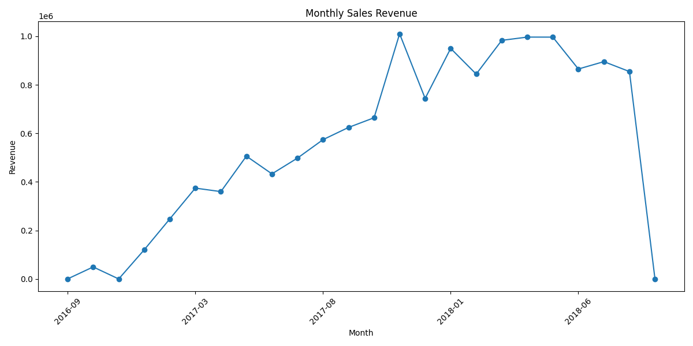
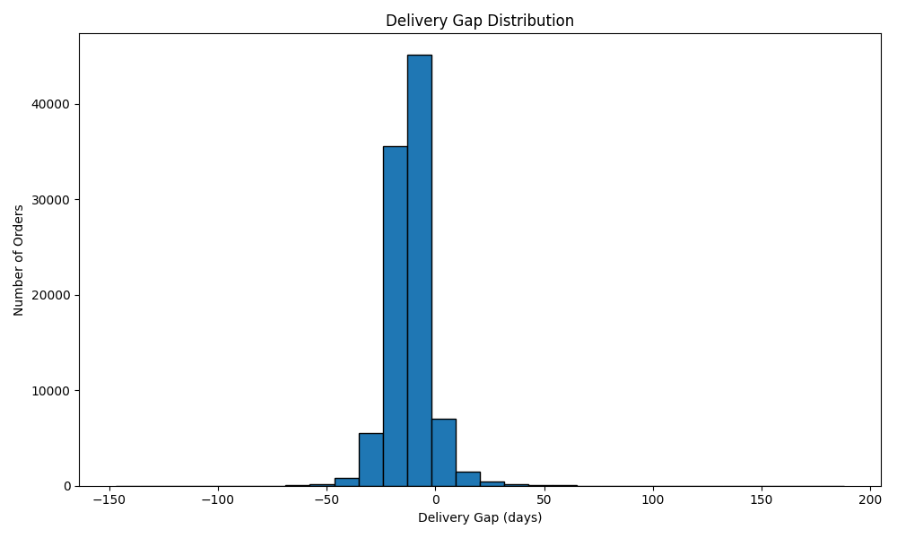
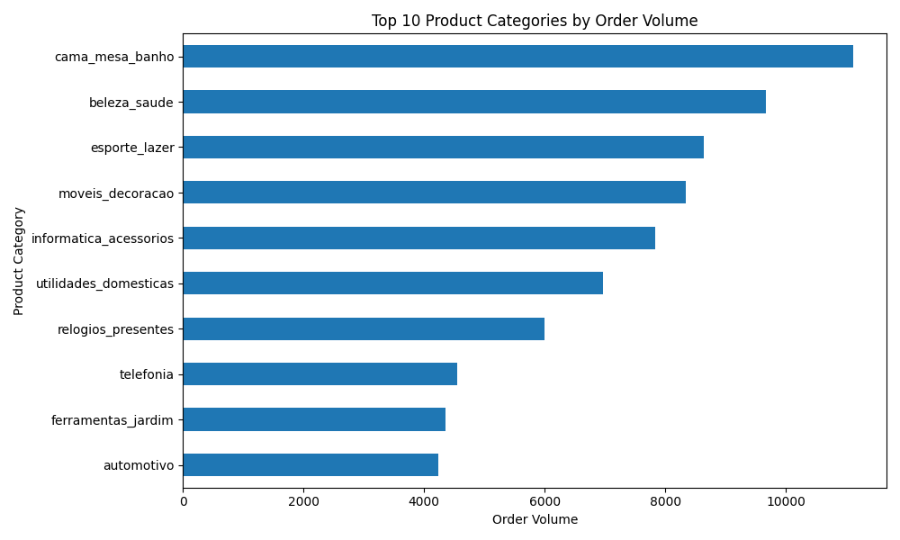
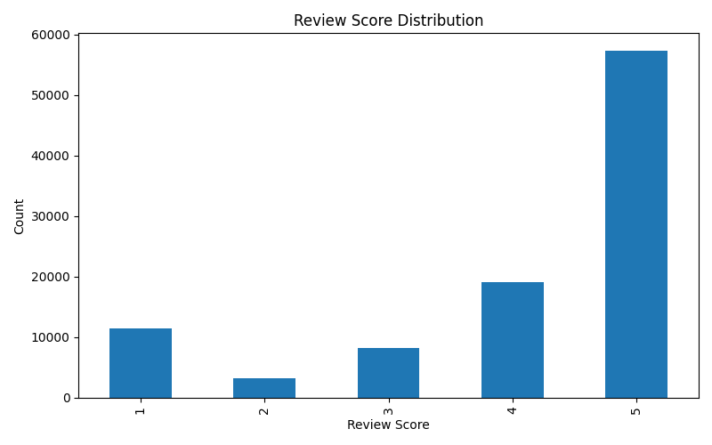

#  Retail data Pipeline

##  Project Overview
This project analyzes the Olist Brazilian E-Commerce dataset to identify logistics issues, customer behavior, and sales trends.

The goal was to build a complete data pipeline that:
- cleans raw data
- validates data quality
- performs exploratory analysis
- generates business insights

---

##  Business Problem
Olist is experiencing:
- shipping delays
- high freight costs
- inconsistent customer satisfaction

This project answers:
- Which areas have the worst delivery performance?
- What are the sales trends over time?
- Which product categories are most popular?
- How do customers rate their experience?

---

##  Tools & Technologies
- Python (Pandas, NumPy)
- Matplotlib
- MySQL (Phase 3)

---

##  Data Pipeline
1. Loaded raw CSV datasets
2. Cleaned and validated data
3. Converted timestamps to datetime
4. Removed invalid records
5. Created new features (e.g., delivery gap)
6. Performed exploratory data analysis (EDA)
7. Generated and saved visualizations

---

## Key Visualizations

### Monthly Sales Revenue

---

### Delivery Gap Distribution

---

### Top Product Categories

---

###  Review Score Distribution

---

##  Key Insights
- Sales show strong seasonal trends with peaks during major shopping periods
- Delivery performance varies significantly, with some orders arriving late
- Certain product categories dominate order volume
- Customer review scores are mostly positive but vary by category

---

## Project Structure
